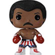
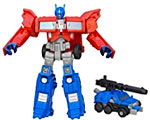
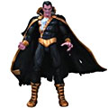
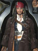
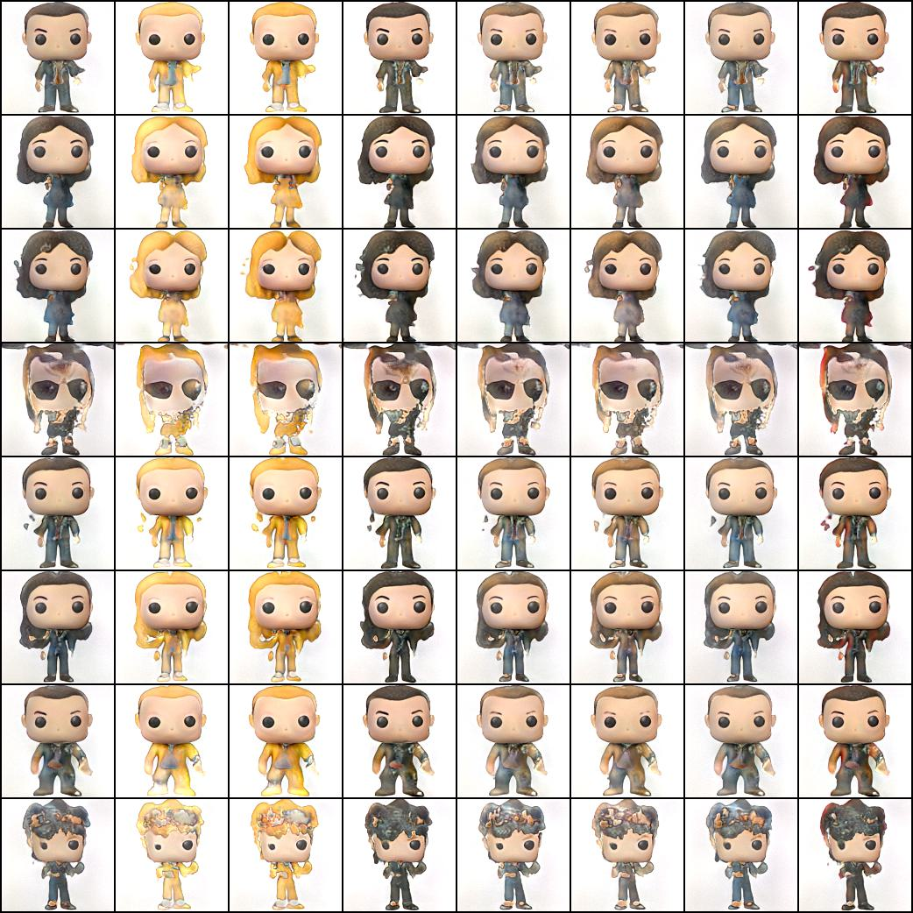
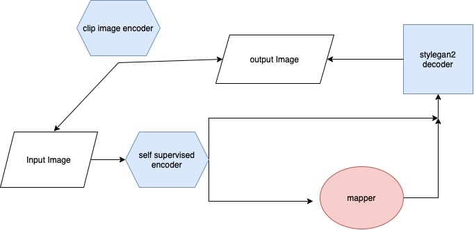

# ToyHollyWood Image Genrating and clustering

By scraping this [Toys Store site](https://www.toyhollywood.com/index.php) I created the [ToyHollyWood Dataset](https://www.kaggle.com/datasets/irotem98/toyhollywood) of 15,300 images of 27 difrrent classes of toys.


 
 
 


## clustering
cluster the image feachers from the encoder.

the scatter in assets.


Models:

1. clip unsupervised
2. simple vae
3. simple vae with added loss from [piq](https://github.com/photosynthesis-team/piq) called ["DISTS"](https://arxiv.org/abs/2004.07728)

clusters accuracy:

|  | CLIP  | VAE-DISTS |VAE |  
--- | --- | ---| --- |
[kmeans](https://en.wikipedia.org/wiki/K-means_clustering) | 0.239 | 0.247| 0.249
[AgglomerativeClustering](https://en.wikipedia.org/wiki/Hierarchical_clustering) | 0.3 | 0.243| 0.282
[Birch](https://medium.com/geekculture/balanced-iterative-reducing-and-clustering-using-hierarchies-birch-1428bb06bb38) | **0.316** | 0.269| 0.291
[SpectralClustering](https://en.wikipedia.org/wiki/Spectral_clustering) | 0.251 | 0.251| 0.246
[GaussianMixture](https://towardsdatascience.com/gaussian-mixture-models-for-clustering-3f62d0da675) | 0.25 | 0.225| 0.217 


## image genration


Using the cluster I created a dataset of only [humans pop toys](https://www.kaggle.com/datasets/irotem98/funkopop-humans) and used super resulation model, then tried some method to generate new pop toys.

| model |FID  |
--- | --- |
[fast-gan](https://arxiv.org/abs/2101.04775) | 4.01
[stylegan2](https://arxiv.org/abs/1912.04958) | 2.15
diffusion T=300 | TDB

### fast-gan example


### stylegan examples



### mapper
using self supervised model to get the featchers of a pop image we can create a mapper from a pop image to create a new pop image simiiler using stylegan2 as a decoder.


when blue models are frozen and the mapper is training. the loss function is:

```math
L_{mapper} = L_1(x,x') + L_1(E_{clip}(x),E_{clip}(x')) + L_1(E(x),E(x')) + L_{dists}(x,x')
```

when x is the original image,E is the self supervised encoder,D is the stylegan decoder and E_{clip} is the clip pretrained encoder, x' is the image when x' = D(E(x) + mapper(E(x))).


| self supervised method | FID
--- | --- |
| [SimCLR](https://arxiv.org/abs/2002.05709)|  0.9937 |


