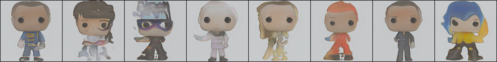

# ToyHollyWood Image Genrating and clustering

By scraping this [Toys Store site](https://www.toyhollywood.com/index.php) I created the [ToyHollyWood Dataset](https://www.kaggle.com/datasets/irotem98/toyhollywood) of 15,300 images of 27 difrrent classes of toys.

 
 
 

## clustering
cluster the image feachers from the encoder.

the scatter in assets.

Models:

1. clip unsupervised
2. simple vae
3. simple vae with added loss from [piq](https://github.com/photosynthesis-team/piq) called ["DISTS"](https://arxiv.org/abs/2004.07728)

clusters accuracy:

|  | CLIP  | VAE-DISTS |VAE |  
--- | --- | ---| --- |
[kmeans](https://en.wikipedia.org/wiki/K-means_clustering) | 0.239 | 0.247| 0.249
[AgglomerativeClustering](https://en.wikipedia.org/wiki/Hierarchical_clustering) | 0.3 | 0.243| 0.282
[Birch](https://medium.com/geekculture/balanced-iterative-reducing-and-clustering-using-hierarchies-birch-1428bb06bb38) | **0.316** | 0.269| 0.291
[SpectralClustering](https://en.wikipedia.org/wiki/Spectral_clustering) | 0.251 | 0.251| 0.246
[GaussianMixture](https://towardsdatascience.com/gaussian-mixture-models-for-clustering-3f62d0da675) | 0.25 | 0.225| 0.217 

## image genration

Using the cluster I created a dataset of only [humans pop toys](https://www.kaggle.com/datasets/irotem98/funkopop-humans) and used super resulation model, then tried some method to generate new pop toys.

| model |FID  |
--- | --- |
[fast-gan](https://arxiv.org/abs/2101.04775) | 4.01
[stylegan2](https://arxiv.org/abs/1912.04958) | TBD
diffusion T=300 | TDB

